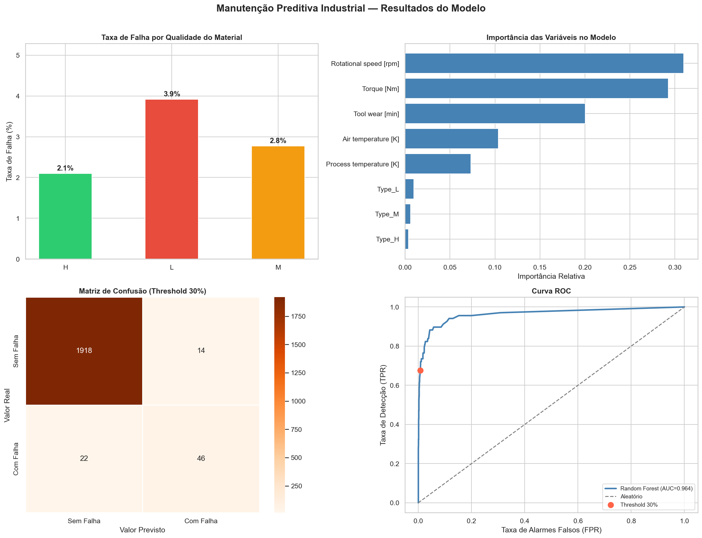
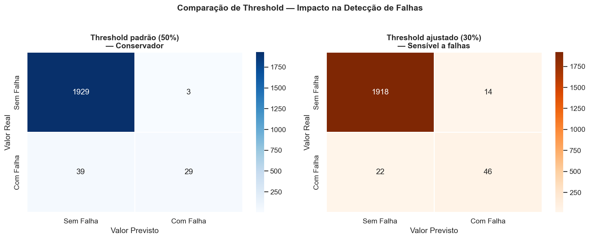

# Manutenção Preditiva Industrial

## O problema

Paradas não planejadas de equipamentos são um dos maiores custos numa operação industrial. Quando uma máquina quebra sem aviso, a linha para, o prazo atrasa e o custo de reparo é muito maior do que teria sido se alguém tivesse intervindo antes. Presenciei muitas vezes estas paradas de produção no meu estágio na TUPY.

A pergunta que motivou esse projeto foi simples: **dá para prever uma falha antes que ela aconteça, usando apenas os dados que os sensores já geram?**

## O que foi feito

Usei um dataset real com 10.000 registros de uma máquina industrial, disponível publicamente no UCI Machine Learning Repository. Cada registro tem informações como temperatura, rotação, torque e tempo de uso da ferramenta — e indica se a máquina falhou ou não naquele momento.

Treinei um modelo de classificação para aprender o padrão que antecede uma falha e, a partir daí, conseguir prever quando a próxima vai acontecer.

## Um detalhe importante

Apenas 3,4% dos registros são de falhas. Isso significa que um modelo mal construído poderia simplesmente responder "sem falha" para tudo e acertar 96,6% das vezes — sendo completamente inútil na prática.

Para resolver isso, ajustei o limite de decisão do modelo: em vez de alertar só quando tem mais de 50% de chance de falha, ele alerta a partir de 30%. Isso aumenta a sensibilidade do sistema — preferimos investigar um alarme falso a deixar uma falha passar despercebida.

## Resultados

- O modelo detecta **68% das falhas reais** — contra 43% antes do ajuste
- Quando ele dá alarme, está certo em **77% das vezes**
- Gera apenas **1% de alarmes falsos** sobre o total de operações normais
- AUC-ROC de **0.964** — bem acima do limite de 0.8 considerado bom para aplicações industriais





## O que o modelo aprendeu

As variáveis mais importantes para prever falha foram **rotação e torque** — juntas respondem por 60% do poder preditivo do modelo. Isso faz sentido físico, pois são os parâmetros dinâmicos da máquina, que refletem o esforço real do equipamento em cada momento.

A qualidade do material (tipo L, M ou H) também influencia: peças de baixa qualidade falham quase o dobro das de alta qualidade (3,9% vs 2,1%).

## Como rodar

```bash
# Clone o repositório
git clone https://github.com/adalciohugo/predictive-maintenance-manufacturing

# Instale as dependências
pip install -r requirements.txt

# Abra o notebook
jupyter notebook analise_manutencao_preditiva.ipynb
```

## Arquivos

```
├── analise_manutencao_preditiva.ipynb   ← análise completa com comentários
├── ai4i2020.csv                         ← dataset original (UCI)
├── painel_resultados.png                ← visualização consolidada
├── requirements.txt
└── README.md
```

## Fonte dos dados

AI4I 2020 Predictive Maintenance Dataset — UCI Machine Learning Repository  
https://archive.ics.uci.edu/dataset/601/ai4i+2020+predictive+maintenance+dataset

## Autor

**Adálcio Hugo Gonçalves dos Santos**  
Engenheiro de Materiais — CEFET-MG  
[LinkedIn](https://linkedin.com/in/adalcio-hugo) · [GitHub](https://github.com/adalciohugo)
